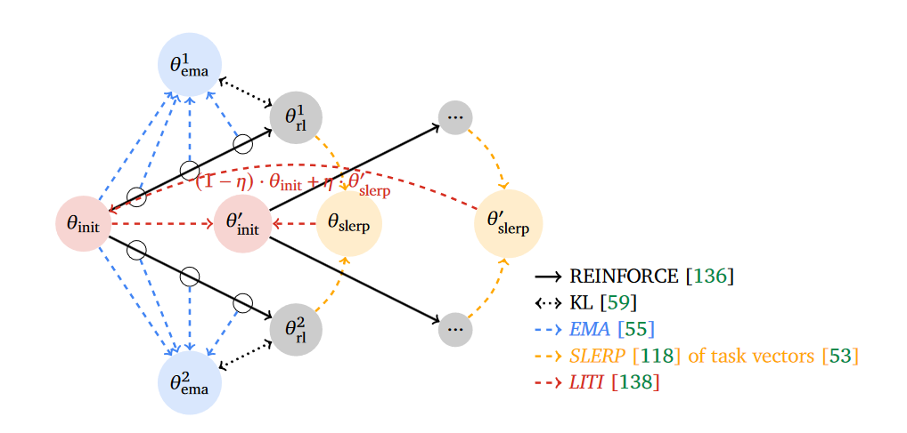

# Отчет о проделанной работе:

В ходе работы я проводил эксперименты по воспроизведению результатов из статьи [WARP: On the Benefits of Weight Averaged Rewarded Policies](https://arxiv.org/abs/2406.16768).

В ходе работы я использовал следубщие данные и проедобученные модели:
* [stanfordnlp/imdb](https://huggingface.co/datasets/stanfordnlp/imdb) - Датасет в ревью на фильмы, размеченный на негативные и позитивные отзывы. В случае данной задачи, конечная цель - обучить модель генерировать только положительные отзывы, незивисимо от того, какой изначальный промпт был задан для нее.
* [lvwerra/gpt2-imdb](https://huggingface.co/lvwerra/gpt2-imdb) - модель, которая будет использоваться для генерации отзывов. Ее alignment'ом я и буду заниматься
* [distilbert/distilbert-base-cased](https://huggingface.co/distilbert/distilbert-base-cased) - модель для получения reward'a (с ее помощью я буду определять, насколько отзыв положительный)

 **Весь процесс проеведения экспериментов может быть разбит на следующие шаги:**

1) Подготовка данных для обучения reward модели и само ее обучение.
2) Подготовка датасета промптов для aligment'a целевой модели
3) Имплементация алгоритма WARP, описанного в статье
4) Обучение целевой модели с помощью заимплеменченного метода
5) Тестирование полученного результата, сравнение с базовой версией модели, подведение итогов обучения
5) Тюнинг гиперпараметров, оценка и анализ влияния на процесс обучения и итоговый результат

### Подготовка reward модели:
В качестве данных для дообучения исходного BERT'a на генерацию reward'ов я составил датасет из отзывов, каждый семпл которого представляет из себя пару - (positive review|negative review). Всего в датасете было 25000 отзывов поровну разделенных на негативные и позитивные(первая половина данных - позитивные, вторая - негативная). Исходя из этого я составил 12500 пар, просто сконкатенировав первую и вторую половину данных.

Для обучения модели на этих данных я:
* Взял версию модели предобученную на Sequence Classification
* Поменял classification head на предсказание 1 скаляра на выходе (reward)
* Обучил модель с помощью RewardTrainer'a из trl

Для обучения я использовал следующие параметры:
```python
reward_config = RewardConfig(
    output_dir="reward_model",
    num_train_epochs=3,
    per_device_train_batch_size=8,
    per_device_eval_batch_size=8,
    warmup_steps=50,
    weight_decay=0.01,
    logging_dir="./logs",
    learning_rate=1e-5,
    do_eval=False,
    report_to='wandb',
    max_length=512,
    remove_unused_columns=False,
    logging_steps=50,
    run_name='reward_model_train'
)
```
В ходе обучения все прошло успешно, модель научилась правильно выдавать reward для позитивных отзывов:


### Подготовка данных для aligment'a
Для тестовых данных я взял 10 токенов из каждого семпла изначальных данных, которые во время обучения буду использовать в качестве промпта для генерации.

### Идея метода WARP
Основная идея стратегии, с помощью которой в методе WARP обучают модель выглядит следующим образом:

Сам алгоритм выглядит следующим образом:


Основная новизна данного алгоритма заключается в том, что KL регуляризация считается не между изначальной моделью и текущей версией (как в PPO или DPO), а между усреднением по весам, котрое обновляется в процессе обучения. Авторы утверждают что такая жесткая регуляризация может привести к reward hacking'у или маловариативной генерации конечной версии модели. 

Для итеративного обновления anchor'а, от политики которого модель не должна далеко уходить в процессе обучения авторы предлагают 3 основных этапа:

1) На каждом шагу штрафовать не за KL с изначальной версией модели, а за KL c EMA по весам в процессе одной итерации алгоритма. 
2) После нескольких паралельный RL итераций со штрафом с EMA, смерджить веса этих ранов с помощью SLERP. Важно подметить, что мерджатся не сами модели а разницы в весах по каждому слою в зависимости от RL рана. Таким образом комбинируются сильные стороны от каждого рана.
3) Последний важный шаг алгоритма - интерполяция смердженой версии модели с прошлого шага и изначальной версии. Эта интерполяция служит как балансировка между большим ревардом(хорошо) и большим KL(плохо).

### Имплементация WARP и обучение модели:

Процесс обучения производился со следующиими гиперпараметрами:
```yaml
training:
  device: "cuda"
  lr: 1e-5
  batch_size: 64
  seed: 42
  device_id: 2

warp:
  I: 2
  M: 2
  T: 100
  mu: 0.01
  nu: 0.5
  beta: 0.1

generation_config:
  bos_token_id: 50256
  eos_token_id: 50256
  pad_token_id: 50256
  max_length: 64
  use_cache: true
  temperature: 0.7
  top_k: 0.0
  top_p: 1.0
  do_sample: true
  return_tensors: "pt"
```

В процессе обучения reward и KL с изначальной версией модели вели себя следующим образом:


В конце обучения KL-reward Pareto Front выглядит следующим образом:


Как видно из граффика, увеличение $\eta$ стабильно увеличивает KL между версиями модели, но не всегда приводит к увеличению награды. Исходя из этого я решил провести дополнительный эксперимент. Так как $T$ в нашем случае сильно меньше, чем в оригинальной статье, и модель имеет значительно меньщше параметров, то возможна ситуация, что метод не успевает сойтись. Поэтому я провел дополнительный эксперимент  с увеличенным learning rate. Вместо `1e-5` я использовал `1e-4`. В итоге я получил следующие результаты:


Как видно, в этом случае KL-reward Pareto Front уже принимает значение, похожее на результаты из оригинальной статьи. С увеличением $\eta$ растет как KL, так и reward. 

Если оценить средний reward генерации на тестовом сете между двумя моделями:


Как видно, средний reward у модели с большим learning rate'ом выше. Однако ее KL относительно начальной модели также значительно выше, чем у варианта со меньшим learning rate'ом. 

Если сравннить Pareto Front этих двух экспериментов


В целом видно, что эксперименты показывают примерно одинаковые результаты. И какой из них показывает себя лучше зависит от того, насколько важно иметь небольшой KL или большой reward. 

### Тюнинг гиперпараметров:
Для оценки влияния гиперпараметров на WARP я провел эксперименты с различными значениями $\mu$:
* $\mu$ = 0.01
* $\mu$ = 0.05
* $\mu$ = 0.1

Это шаг обновления экспоненциального скользящего среднего (EMA), где $\mu$ управляет скоростью обновления EMA anchor $\theta^{m}_{EMA}$ на основе текущих весов $\theta^m$.

То есть при увеличении $\mu$, $\theta_{EMA}^{m}$ будет больше похож на $\theta^m$ А так как, в идее алгоритма reward регулируется с помощью $\frac{\pi_{\theta^m}}{\pi_{\theta^m_{EMA}}}$, то приближение этих двух policy уменьшит штраф для $r_\beta$, соответственно позволяя делать алгоритму более агрессивные шаги в policy gradient. 

То есть, увеличение этого параметра уменьшает регуляризацию примерно таким же образом, как увеличение $\beta$. К примерно такому же выводу пришли авторы оригинальной статьи:


В результате работы алгоритма с выбранными значениями я получил следующие результаты:


Как видно из графиков, с уменьшением $\mu$, KL между текущей версией модели и базовой также в среднем меньше во время обучения. Выразительнее это начинает проявляться начиная с шага 200. На этом шаге алгоритм переходит на вторую итерацию по $i$. Всвязи с этим изменяется $\theta_{init}$, который используется инициализация. И так как при большем $\mu$ алгоритм делал более агрессивные шаги, то и KL у нового $\theta_{init}$ будет больше. 

KL-reward Pareto Front также показывает похожую тенденцию. При увеличении $\mu$ растет также и reward, но и KL. Примечательно, что конечная точка при $\mu = 0.05$ имеет незначительную разницу в reward, при этом относителньо сильно отличается по KL. Из этого можно предположить, что $\mu = 0.05$ является самым оптимальным значением параметра из всех рассмотренных.

Если собрать статисктику на тестовом сете, то можно увидеть следующие результаты:


Преположение также подтверждается на тестовом сете. При небольшой разнице в средем реварде, средний KL значительно отличается.


## Приложение

### Интструкции по воспроизведению экспериментов:
Для подготовки enviroment'a:
```shell
conda env create --file environment.yaml
```

Далее для запуска полного пайплайна:

**Создать датасет из пар (positive|negative):**
```shell
python scripts/prepare_data_reward.py --split train
```

**Обучить reward модель:**
```shell
python scripts/reward_model_train.py 
```

**Создать датасет промптов:**
```shell
python scripts/prepare_prompts_dataset.py --split train
```

**Обучить модель с помощью метода WARP:**
```shell
python scripts/warp.py
```
Параметры для обучения настроиваются через конифг в `configs/train_config.yaml`


**Подготовить датасет промптов для тестовой выборки для evaluation'а:**
```shell
python scripts/prepare_prompts_dataset.py --split test
```

**Собрать reward и KL на тестовых данных для обученной модели и изначальной:**
```shell
python python scripts/model_eval.py
``` 
Параметры для eval'а настраиваются через `configs/eval_config.yaml`

### Дополнительные ссылки:
* [Проект на wandb](https://wandb.ai/nikitasergeev692/WARP_imdb?nw=nwusernikitasergeev692)
* [Репорт с основными результатами полученными в ходе проведения экспериментов](https://api.wandb.ai/links/nikitasergeev692/xpk1hpi9)